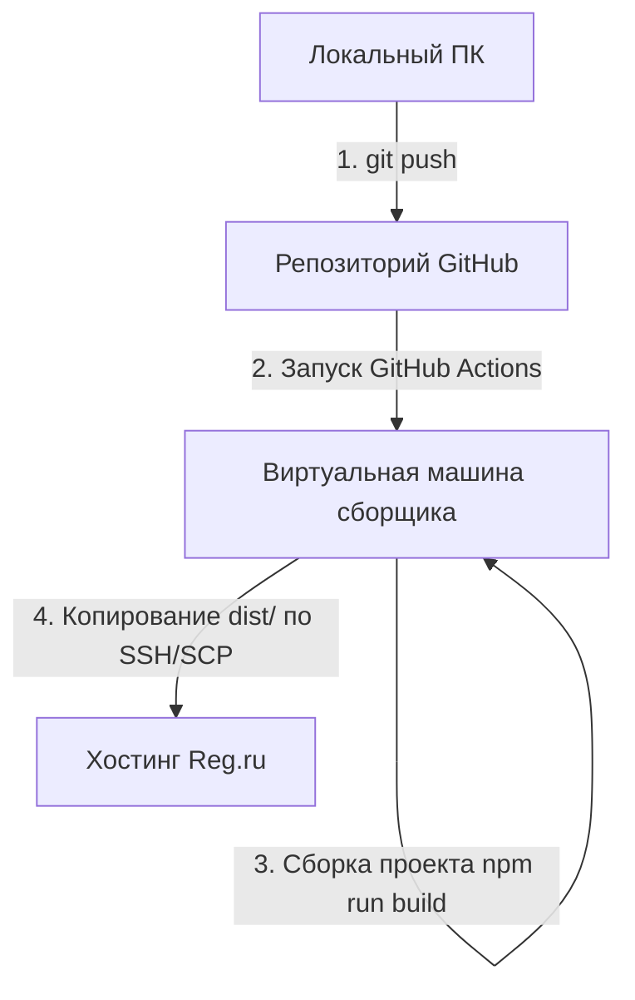

# Документация по автодеплою park-sever.ru

Этот проект настраивается для автоматической сборки и публикации на виртуальный хостинг Reg.ru при каждой отправке (push) изменений в ветку `main` репозитория GitHub.

---

## Архитектура связи локальной машины, GitHub и хостинга



### 1. Связь с хостингом
* **Адрес сервера (Host):** `server66.hosting.reg.ru`
* **Пользователь хостинга (User):** `u0124240`
* **Каталог сайта на хостинге:** `/var/www/u0124240/data/www/park-sever.ru`
* **Протокол передачи:** SSH/SCP (Порт 22).

### 2. Безопасность и авторизация
* На хостинге Reg.ru авторизация происходит с помощью **SSH-ключей**:
  * **Приватный ключ** добавляется в секреты репозитория GitHub под именем `SSH_PRIVATE_KEY` (используется тот же ключ, что и для noblefarm.ru — `noblefarm_key`).
  * **Публичный ключ** прописан на сервере хостинга в файле `~/.ssh/authorized_keys` пользователя `u0124240`.
  * Пользователь хостинга сохранен в секретах GitHub как `HOSTING_USER`.

### Локальные пути к ключам на вашей Windows-машине:
* **Приватный ключ для деплоя:** `C:\Users\User\.ssh\noblefarm_key`
* **Публичный ключ для деплоя:** `C:\Users\User\.ssh\noblefarm_key.pub`
* **Другие ключи в системе:** также в папке `C:\Users\User\.ssh\` находятся ключи `fgsever_key` и `sprinthost_key`.

---

## Как устроен сценарий деплоя (GitHub Actions)

Сценарий будет находиться в файле `.github/workflows/deploy.yml`. Он будет запускаться автоматически при любом пуше в ветку `main`.

### Этапы работы сценария:
1. **Получение кода (Checkout):** Стягивает последний код репозитория.
2. **Настройка Node.js:** Устанавливает окружение Node.js 20.
3. **Установка зависимостей:** Выполняет команду `npm ci` для быстрой и чистой установки пакетов.
4. **Сборка проекта:** Запускает команду `npm run build`, которая генерирует готовую статическую сборку в папку `dist/`.
5. **Публикация (SCP):** 
   * Подключается к серверу `server66.hosting.reg.ru` по SSH с использованием приватного ключа.
   * Очищает старые файлы в папке `/var/www/u0124240/data/www/park-sever.ru`.
   * Загружает содержимое папки `dist/` на сервер.

---

## Инструкция по созданию резервной копии (бэкапа) перед первым деплоем

Чтобы сохранить старую версию сайта на хостинге, выполните команду на сервере или попросите ИИ сделать это перед включением автодеплоя:

```bash
# Подключение к серверу
ssh -i ~/.ssh/noblefarm_key u0124240@server66.hosting.reg.ru

# Переход в папку доменов и создание папки бэкапа
cd www/park-sever.ru
mkdir -p _old_backup

# Перемещение всех файлов текущего сайта в бэкап (за исключением самого бэкапа и служебного файла Яндекса)
find . -maxdepth 1 ! -name '.' ! -name '..' ! -name '_old_backup' ! -name 'yandex_5c4fc03d4800f700.html' -exec mv {} _old_backup/ \;
```

---

## Инструкция: Как вносить правки

1. Внесите изменения в исходный код сайта локально в этой папке.
2. Откройте терминал и выполните три команды для отправки кода на GitHub:
   ```bash
   git add .
   git commit -m "Описание внесенных изменений"
   git push origin main
   ```
3. Отслеживать процесс сборки и публикации можно на странице репозитория во вкладке **Actions**:
   `https://github.com/Nikitaa2333333/park-sever-redesign/actions`
